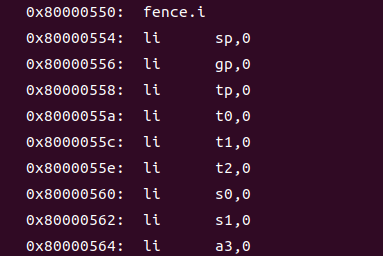
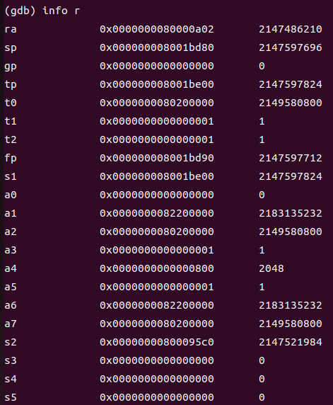

# ucore启动过程

## 1.从复位代码处开始执行

+ 主板上电后，首先执行复位代码。在QEMU模拟的这款risc-v处理器中，将复位向量地址初始化为0x1000，再将PC初始化为该复位地址，因此处理器将从此处开始执行复位代码，复位代码主要是将计算机系统的各个组件（包括处理器、内存、设备等）置于初始状态，并且会启动Bootloader，0x80000000是链接的起始位置，Bootloader将加载操作系统内核并启动操作系统的执行（但在我们的lab0中操作系统内核已经被qemu加载到指定地址）。
+ 完成计算机系统各个组件初始化后，准备跳转到bootloader（OpenSBI固件）处执行，此时t0寄存器存储的即为bootloader入口地址
+ 以上复位寄存器处代码存储在`~/qemu-3.1.0/hw/riscv/spike.c`中（qemu-3.1.0由命名确定）
+ `0x100c:	ld	t0,24(t0)`在t0初始化为0x1000后，t0+24可以访问到地址0x1018，而这个地址在加载初期就已经初始化为0x80000000，所以即使在0x1018位置显示的是unimp，执行`0x1010:	jr	t0`依旧可以跳转到地址0x80000000。

## 2.OpenSBI

代码跳转到0x80000000处后控制权转交给OpenSBI，此时OpenSBI要经历以下几个阶段

### 底层初始化阶段

+ **判断hard id**：取启动处理器的 ID，并将其保存到寄存器 a6 中，然后检查该处理器是否为启动处理器，如果不是则跳转到等待重定位完成的循环中，否则执行接下来的步骤。

  ```
  0x80000000      csrr   a6,mhartid
  0x80000008      auipc  t0,0x0
  ```
  
+ **代码重定位**：如果未成功获取启动处理器 ID 或者获取到的处理器 ID 不是当前处理器，则执行随机选择重定位目标地址的过程，即尝试从 `_relocate_lottery` 标签处开始循环等待。根据 `_link_start` 和 `_link_end` 标签获取链接地址， `_load_start` 标签获取加载地址，并判断二者是否相同。如果不同，则需要进行重定位操作。在我们的ucore中通过gdb追踪代码如下：
  
  
+ **清除寄存器值**：在完成代码重定位后，我们需要清除寄存器值，继续使用gdb追踪代码如下：
  
  &nbsp;

  >调用0x80000550处函数进行寄存器初始化

  

+ **清除bss段**：如果要想c语言执行起来，必须要做的事情有两个，一个是设置sp栈地址，另外就是清除bss段。
  
+ **准备 scratch 空间**：从地址0x800001b8开始我们进行初始化`struct sbi_scratch` 结构体，这个结构体将会传递给 `sbi_init()` 函数。（篇幅原因仅列出部分代码）
  
  ```

   _scratch_init:
  /*

  + The following registers hold values that are computed before
  + entering this block, and should remain unchanged.
  *
  + t3 -> the firmware end address
  + s7 -> HART count
  + s8 -> HART stack size
  + s9 -> Heap Size
  + s10 -> Heap Offset
  */
  add tp, t3, zero
  sub tp, tp, s9
  mul a5, s8, t1
  sub tp, tp, a5
  li a5, SBI_SCRATCH_SIZE
  sub tp, tp, a5

  /*Initialize scratch space*/
  /*Store fw_start and fw_size in scratch space*/
  lla a4, _fw_start
  sub a5, t3, a4
  REG_S a4, SBI_SCRATCH_FW_START_OFFSET(tp)
  REG_S a5, SBI_SCRATCH_FW_SIZE_OFFSET(tp)

  /*Store R/W section's offset in scratch space*/
  lla a5, _fw_rw_start
  sub a5, a5, a4
  REG_S a5, SBI_SCRATCH_FW_RW_OFFSET(tp)

  /*Store fw_heap_offset and fw_heap_size in scratch space*/
  REG_S s10, SBI_SCRATCH_FW_HEAP_OFFSET(tp)
  REG_S s9, SBI_SCRATCH_FW_HEAP_SIZE_OFFSET(tp)

  /*Store next arg1 in scratch space*/
  MOV_3R s0, a0, s1, a1, s2, a2
  call fw_next_arg1
  REG_S a0, SBI_SCRATCH_NEXT_ARG1_OFFSET(tp)
  MOV_3R a0, s0, a1, s1, a2, s2
  /*Store next address in scratch space*/
  MOV_3R s0, a0, s1, a1, s2, a2
  call fw_next_addr
  REG_S a0, SBI_SCRATCH_NEXT_ADDR_OFFSET(tp)
  MOV_3R a0, s0, a1, s1, a2, s2
  /*Store next mode in scratch space*/
  MOV_3R s0, a0, s1, a1, s2, a2
  call fw_next_mode
  REG_S a0, SBI_SCRATCH_NEXT_MODE_OFFSET(tp)
  MOV_3R a0, s0, a1, s1, a2, s2
  /*Store warm_boot address in scratch space*/
  lla a4, _start_warm
  REG_S a4, SBI_SCRATCH_WARMBOOT_ADDR_OFFSET(tp)
  /* Store platform address in scratch space */
  lla a4, platform
  REG_S a4, SBI_SCRATCH_PLATFORM_ADDR_OFFSET(tp)
  /* Store hartid-to-scratch function address in scratch space */
  lla a4,_hartid_to_scratch
  REG_S a4, SBI_SCRATCH_HARTID_TO_SCRATCH_OFFSET(tp)
  /*Store trap-exit function address in scratch space*/
  lla a4, _trap_exit
  REG_S a4, SBI_SCRATCH_TRAP_EXIT_OFFSET(tp)
  /* Clear tmp0 in scratch space */
  REG_S zero, SBI_SCRATCH_TMP0_OFFSET(tp)
  /* Store firmware options in scratch space */
  MOV_3R s0, a0, s1, a1, s2, a2

  ```

+ **读取设备树（Flattend Device Tree, FDT）**：首先，通过前一个启动阶段传递过来的参数 a0、a1 和 a2，保存了当前 FDT 的源地址指针。接着，通过调用函数 fw_next_arg1()获取下一个启动阶段传递过来的参数 a1，即将被重定位到的 FDT 的目标地址指针。如果 a1 为 0 或者 a1 等于当前 FDT 的源地址指针，则说明不需要进行重定位，直接跳转到_fdt_reloc_done 标签处。如果需要进行重定位，则需要计算出源 FDT 的大小，并将其从源地址拷贝到目标地址，完成重定位。具体操作如下：
    1. 首先，将目标地址按照指针大小对齐，并保存为 t1。
    2. 然后，从源地址中读取 FDT 大小，该大小为大端格式，需要将其拆分为四个字节：bit[31:24]、bit[23:16]、bit[15:8]和 bit[7:0]，并组合成小端格式，保存在 t2 寄存器中。
    3. 接着，将 t1 加上 t2，得到目标 FDT 的结束地址，保存在 t2 寄存器中。这样就确定了拷贝数据的范围。
    4. 最后，循环拷贝数据，将源 FDT 中的数据拷贝到目标 FDT 中。循环次数为源 FDT 大小除以指针大小，即源 FDT 中包含的指针数量。

  ```

  _fdt_reloc_again:
  REG_L t3, 0(t0)
  REG_S t3, 0(t1)
  add t0, t0, **SIZEOF_POINTER**
  add t1, t1, **SIZEOF_POINTER**
  blt t1, t2,_fdt_reloc_again
  _fdt_reloc_done:

  /*mark boot hart done*/
  li t0, BOOT_STATUS_BOOT_HART_DONE
  lla t1, _boot_status
  REG_S t0, 0(t1)
  fence rw, rw
  j _start_warm
 
  ```

   完成拷贝后，将 BOOT_STATUS_BOOT_HART_DONE 保存到_boot_status 寄存器中，表示当前处理器已经完成启动。最后，通过调用_start_warm 跳转到下一步操作。

+ **_start_warm**：在初始化过程中，需要禁用和清除所有中断，并设置当前处理器的栈指针和 `trap handler`（异常处理函数）。使用gdb具体追踪，代码如下：

  

   具体执行过程如下：

   1. 首先，调用`_reset_regs`函数，将寄存器状态重置为 0，以保证非引导处理器使用前的状态干净、一致。
   2. 接着，禁用和清空所有中断，即将 CSR_MIE 和 CSR_MIP 寄存器都设置为 0。
   3. 获取 platform 变量的地址，并读取平台配置信息，包括处理器数量（s7）和每个处理器的栈大小（s8）。
   4. 获取当前处理器的 ID（s6），并判断其是否超出了处理器数量的范围。如果超出，则跳转到_start_hang 标签，表示出现了错误。
   5. 计算当前处理器对应的 scratch space 的地址，并将其保存到 CSR_MSCRATCH 寄存器中，作为 SBI 运行时的全局变量。
   6. 将 scratch space 地址保存到 SP 寄存器中，作为当前处理器的栈指针。
   7. 设置 trap handler 为`_trap_handler`函数，即当发生异常时会跳转到该函数进行处理。同时，读取 MTVEC 寄存器的值确保 trap handler 已经设置成功。
   8. 调用`sbi_init`函数进行 SBI 运行时的初始化。`sbi_init`函数将会初始化各种全局变量、锁、Hart Table 等

    

   9. 最后，通过跳转到_start_hang 标签等待处理器发生异常或被重置。

+ **跳转至设备初始化**
  在一系列的初始化之后，需要进行跳转进行内核的加载。此时，可以分析一下程序是在哪里进行跳转的。
  首先猜想是直接通过地址跳转，所以将0x8000000开始的代码进行检查。以下为部分代码：

  

  在文档内直接搜索，可以发现代码中并没有直接跳转至0x80200000，于是推测是通过寄存器进行跳转。

  

  在刚进入gdb后，在0x80200000地址处进行断点，然后直接continue

  

  在跳转后可以发现，下一步就是<kern_entry>

  

  通过`info r`，查看此时的寄存器存储情况

  

  观察可以发现，寄存器t0、a2、a7存储的值为0x80200000
  返回代码处进行搜索回溯，再配合在gdb的多次调试，最终发现是在运行完0x80005036后跳转到了0x80200000
  
  

  
### **OpenSBI设备初始化**

  在前面的过程中opensbi已经基本启动完成，接下来主要进行设备初始化，然后将控制权交给操作系统内核
  
  
  
# 操作系统知识点与原理

 + 使用链接脚本描述内存布局
 + 使用编译工具交叉编译内核，进而生成内核映像
 + 使用opensbi作为bootloader
   + 对应操作系统知识:在计算机启动时，需要先运行一段固化在计算机主板上的程序完成上电和加载操作系统的程序即bootloader
 + 使用 OpenSBI 提供的服务，在屏幕上格式化打印字符串
 + 使用gdb调试程序

# 该实验未涉及的知识点

 + sbi是一种riscv架构中用于操作系统（OS）和硬件监管程序（Hypervisor）之间的标准接口。 它定义了一组指令和数据结构，以使OS和Hypervisor能够共同使用处理器和其他硬件资源。
 + riscv特权等级
